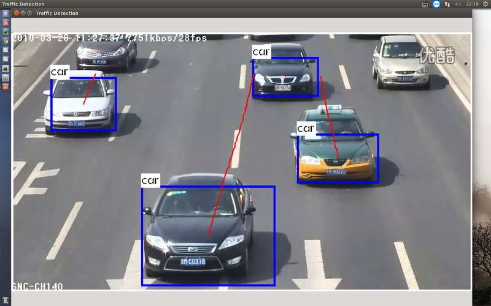
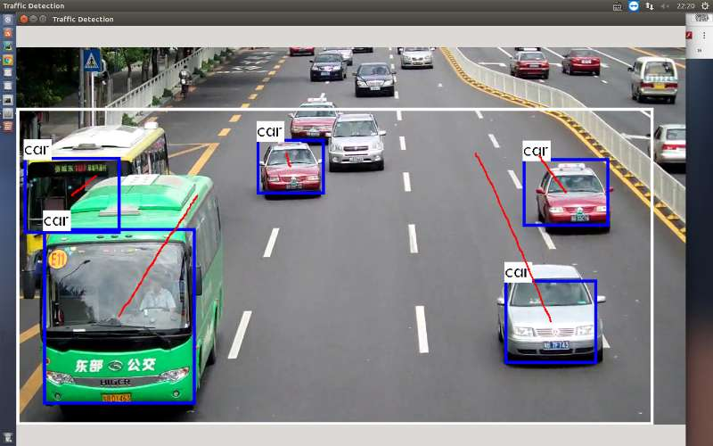
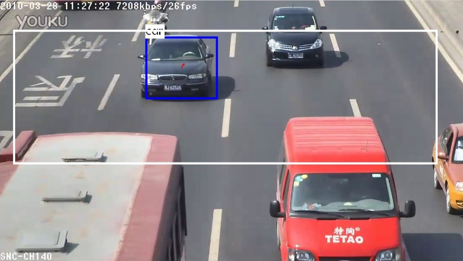

# Vehicle Detection System

## Introduction

This system can be seen as an example program for a traffic flow counting system, which implements the function of tracking and counting vehicles appearing in the area captured by the traffic camera.

The algorithm uses object detection + tracking logic as a whole, the vehicle target is detected by the deep learning algorithm YOLO, and the detected vehicle is tracked by using the KCF algorithm to complete the counting of the vehicle.


This repository embeds the core implementation code of [KCF tracking algorithm](https://github.com/joaofaro/KCFcpp) under the basic framework of the open source project [Darknet](https://pjreddie.com/darknet/). Equivalent to a secondary development program on the basis of Darknet, onlt for communication and reference.

The screenshot of the program is as follows:






## Compile

Just enter the command in the terminal:

```shell
make
```
Note 1: Before compiling, please make sure that OpenCV is installed on the system and add the installation path to the environment variable.

Note 2: The algorithm has been verified on the Ubuntu 16.04 system with GTX1070 graphics card. The algorithm uses the GPU to run the algorithm by default. Please ensure that both CUDA and CUDNN are properly installed.

Note 3: In fact, you can choose whether to use GPU and CUDA acceleration through the first 5 lines in the makefile. But running the algorithm using the CPU will be very slow, and we have not tested whether the algorithm works correctly.

## Execute

You can run the algorithm in two ways:

``` shell
./darknet
```

or

``` shell
./darknet ./SystemParameterSet2.txt
```

The second parameter specifies the configuration file used by the algorithm. If not specified, the default configuration file name SystemParameterSet.txt will be called.

This configuration file is used to set the video that the algorithm will process, as well as various parameters related to the YOLO algorithm, the KCF tracking algorithm, and the system UI properties. For different videos, fine-tuning the parameters in the configuration file can achieve different effects. How to modify these parameters will be explained later.

Here we provide four test videos, and the corresponding default configuration, you may wish to run the following commands separately:

``` shell
./darknet ./SystemParameterSet1.txt
./darknet ./SystemParameterSet2.txt
./darknet ./SystemParameterSet3.txt
./darknet ./SystemParameterSet4.txt
```

## Parameter Settings

**the algorithm input setting parameters** :

*Camera_Index* : Set the device number of the camera called by the algorithm. If you want to read the video file directly, you need to set it to -1, then the algorithm will load the value of DetectVideoPath parameter.

*DetectVideoPath* : Sets the video for traffic detection. The path parameter is valid only when Camera_Index=-1.

**UI parameters** :

The following parameters are used to set the initial position and size of the program visualization form.

*MainWindowWidth* : the width of the initialization form

*MainWindowHeight* : the width of the initialization form

*StartLocationX* : the x coordinate position of the initialization form

*StartLocationY* : the y coordinate position of the initialization form

**Interest Area parameters** :

*InterestedArea_X* :

*InterestedArea_Y* :

*InterestedArea_Width* :

*InterestedArea_Height* :

In order to deal with the possible situations in the detection, you can set the interest area parameters, the algorithm will only detect the vehicles in the region of interest, as shown in the white box below:



In addition to setting the value in the configuration file, the interest area can also be setted by pressing the pause button "p" and use the mouse to select an area, this is much convenient than setting parameters..

**Parameters that often need to be modified** :

These three parameters are most likely to need to be changed for different videos.

*MaxCarArea* : The maximum proportion of the vehicle in the image, which is 0~1. Vehicles that exceed this ratio will not be recognized.

*NMSthresh* : Non-maximum suppression threshold. If the suppression is not good, turn this parameter down.

*TolerateDistance* : The target frame must be at least has the distance of "TolerateDistance" from the edge of the interest area. This parameter is introduced to avoid re-counting problems.

**KCF tracking algorithm parameters** :

*HOG, FIXEDWINDOW, MULTISCALE, SILENT, LAB*

These five parameters are parameters of the KCF algorithm and are not recommended for modification.

**YOLO algorithm parameters** :

*Thresh* : Target Detection Confidence Threshold

*Hier_thresh* : no need to modify, 0.5

*Data_cfg* : ./cfg/coco.data

*Cfg* : ./cfg/yolo.cfg

*Weights* : yolo.weights

The last three parameters are the configuration files that the YOLO algorithm needs to use and the weight of the deep network, and do not need to be modified.

---------------
---------------

# 车辆检测系统（中文版说明）

## 简介

本系统可以看做一个车流量计数系统的示例程序，实现了对交通摄像头拍摄的区域内出现的车辆进行跟踪和计数的功能。

算法整体上采用目标监测+追踪的逻辑实现，通过深度学习算法YOLO进行车辆目标的检测，并对检测到的车辆使用[KCF](https://github.com/joaofaro/KCFcpp)算法进行跟踪，完成车辆的计数。

本仓库在开源项目[Darknet](https://pjreddie.com/darknet/)的基本框架下，嵌入了KCF跟踪算法的核心实现代码。相当于是在Darknet基础上进行的二次开发，仅供交流和参考。

程序运行效果如下：


## 编译

只需在终端中输入命令：

```shell
make
```

注意1：编译前请确保系统已安装OpenCV且将安装路径添加进环境变量中。

注意2：算法已经在拥有GTX1070显卡的Ubuntu16.04系统上进行过验证。算法默认使用GPU运行算法，请确保CUDA和CUDNN均已正确安装。

注意3：事实上，你可以通过Makefile文件中的前5行选择是否使用GPU以及CUDA加速。但使用CPU运行算法将会非常慢，并且我们也没有测试过算法是否可以正确运行。


## 执行

可以使用如下的两种方式运行算法：

```shell
./darknet
```

``` shell
./darknet ./SystemParameterSet2.txt
```

其中第二个参数指定算法使用的配置文件，不指定的话将调用默认的配置文件名SystemParameterSet.txt。

此配置文件用于设置算法将会处理的视频，以及YOLO算法、KCF追踪算法、以及系统UI属性有关的各种参数。针对不同的视频，对配置文件中的参数进行微调可以获得不同的效果。后面会说明如何修改这些参数。

这里已经提供了四个测试用视频，以及对应的默认配置，你不妨尝试分别运行以下命令：

``` shell
./darknet ./SystemParameterSet1.txt
./darknet ./SystemParameterSet2.txt
./darknet ./SystemParameterSet3.txt
./darknet ./SystemParameterSet4.txt
```

## 参数详解

**设置算法输入**：

*Camera_Index* :设置算法调用的摄像头的设备编号。如果想直接读取视频文件，需要置为-1，算法将会去获取DetectVideoPath参数。

*DetectVideoPath* : 设置进行车流检测的视频，路径参数只有当Camera_Index=-1时有效。

**界面参数**：

以下几个参数用于设置程序可视化窗体的初始位置和大小

*MainWindowWidth* : 窗体初始化的宽度

*MainWindowHeight* : 窗体初始化的宽度

*StartLocationX* : 窗体初始化的位置的x坐标

*StartLocationY* : 窗体初始化的位置的y坐标

**感兴趣区域**：

*InterestedArea_X* :

*InterestedArea_Y* :

*InterestedArea_Width* :

*InterestedArea_Height* :

为了应付视频中可能出现的影响检测效果的情况，你可以设置感兴趣区域，算法将只对感兴趣区域内的车辆进行检测，如下图白色框所示：


感兴趣区域除了可以在配置文件中设置默认值，还可以在按下暂停键“p“后，按下鼠标左键框取，这要比设置参数方便很多。

**经常需要修改的参数** :

针对不同的视频，这三个参数最有可能需要改动。

*MaxCarArea* : 车辆在图像中的最大比例，取值0~1，超过了这个比例的车辆将不会被识别。

*NMSthresh* : 非极大值抑制阈值，如果抑制效果不好，将此参数调小。

*TolerateDistance* : 目标框至少要距离感兴趣区域边缘的距离，这个是为了避免重计数引入的变量。

**KCF追踪算法参数** ：

*HOG、FIXEDWINDOW、MULTISCALE、SILENT、LAB*

这五个参数是KCF算法的参数，不建议修改。

**YOLO算法参数** ：

*Thresh* ：目标检测置信度阈值

*Hier_thresh* : 不需要修改，0.5即可

*Data_cfg* : ./cfg/coco.data

*Cfg* : ./cfg/yolo.cfg

*weights* : yolo.weights

后三个参数是YOLO算法需要用到的配置文件以及深度网络的权重，也不需要修改。
